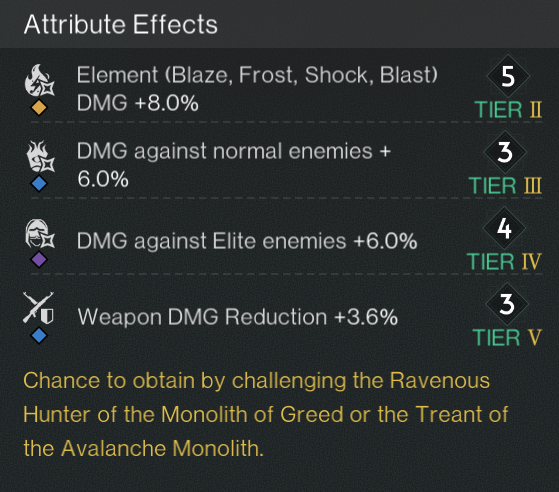
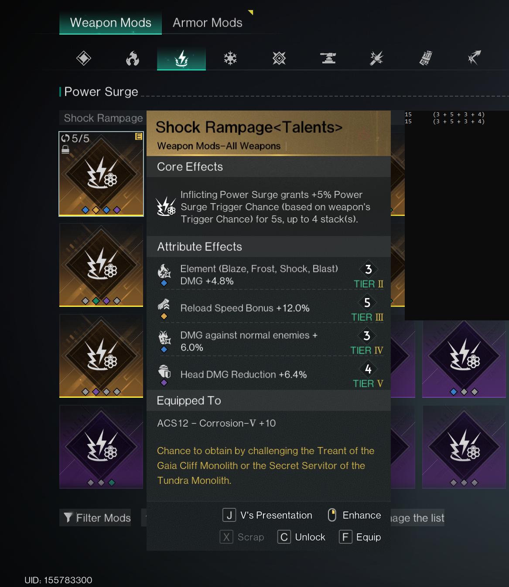

# Once Human Mod Rarity Detector

This tool automatically reads the rarity of a mod in **Once Human** by looking at the tooltip on your screen and printing the rarity in the console.

It is made to be easy to use, even if you don’t have technical knowledge.

---

## What You Need

- Windows PC
- Once Human installed
- The tool folder (with the `.exe`)

---

## First-Time Setup (Very Important)

1. Download the **once_human_mod_level_detector.exe** file.
2. Start **Once Human**.
3. Open your **Mod Inventory**.
4. Hover your mouse over a mod that has **4 attributes**.
5. Take a screenshot of the screen.
6. Crop the screenshot so that **only the attributes part of the tooltip is visible**, like 'example_tooltip.png'. 
7. Save this cropped image in the tool folder and name it:
   tooltip.png
8. Run the tool by double-clicking the `.exe`.

---

## Using the Tool

1. Keep the tool running.
2. Go back to **Once Human**, the tool will stay the topmost window.
3. Hover your mouse over any mod with 4 attributes.
4. The tool will:
   - Detect the mod rarity
   - Display it in the console window 

You do not need to take more screenshots. Just hover the mod and read the result in the console.

---

## Tips

- Make sure the game is in the same resolution as when you took `image1.png`.
- The tool only works with mods that have **four attributes**.
- Keep the game in windowed or borderless mode for best results.
- Try running with admin rights if something doesn't work.